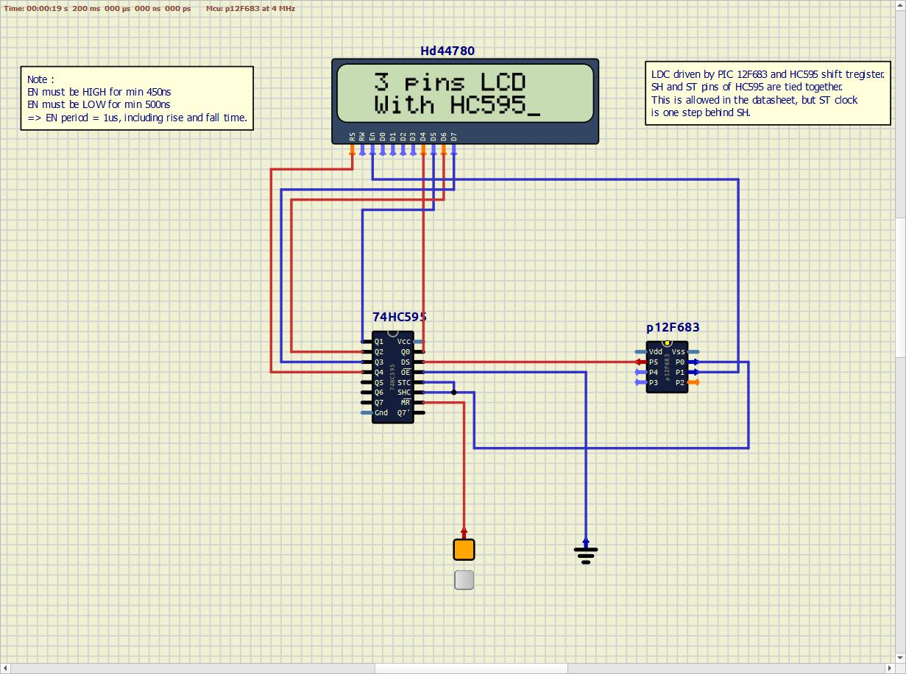

This project drives an LCD with a PIC 12F683 using three wires.
It makes use of the 74HC595 latched shift register possibility to tie both SH and ST clock together (see function table, last entry) :
Below is the HC595 functional diagram :

And the HC595 function table :

The circuit then looks like this :

